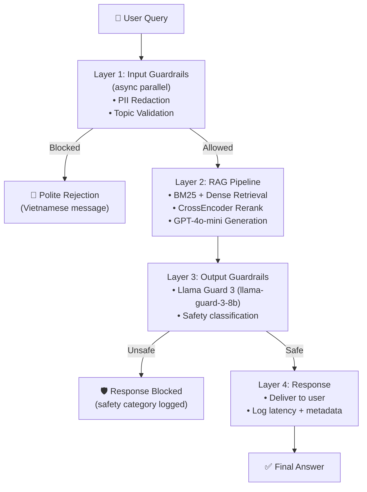

# Phase D: Operational Blueprint

## Section 1: SLO Definition

| Metric | Description | Warning | Critical | Measurement |
|--------|-------------|---------|----------|-------------|
| Faithfulness | RAGAS faithfulness score | <0.75 | <0.70 | Weekly RAGAS run on 50-question set |
| Answer Relevancy | RAGAS answer relevancy score | <0.70 | <0.65 | Weekly RAGAS run on 50-question set |
| PII Block Rate | % of queries with PII that get redacted | <95% | <90% | Daily sample of 100 queries |
| Adversarial Block Rate | % of adversarial prompts blocked | <80% | <70% | Monthly red-team test (20 prompts) |
| p95 Latency | 95th percentile end-to-end query latency | >500ms | >1000ms | Continuous monitoring |

---

## Section 2: Architecture Diagram

---

## Section 3: Alert Playbook

### Incident 1: Faithfulness Drop

- **Trigger:** Faithfulness score drops below 0.70 (critical threshold) in weekly eval
- **Severity:** HIGH
- **Immediate Action:** Page on-call ML engineer, halt new document ingestion
- **Investigation Steps:** Check recent document changes, verify chunking pipeline, review bottom-10 failing questions
- **Resolution:** Apply fix from `phase-a/failure_analysis.md` (increase RERANK_TOP_K, add structure-aware chunking)

---

### Incident 2: PII Leak Detected

- **Trigger:** PII block rate falls below 90% (critical) OR PII detected in a logged response
- **Severity:** CRITICAL
- **Immediate Action:** Disable query logging, notify DPO (Data Protection Officer), trigger incident report
- **Investigation Steps:** Review `phase-c/pii_redaction.py` pattern coverage, check if new PII format appeared
- **Resolution:** Add new PatternRecognizer for the undetected format, re-run adversarial tests

---

### Incident 3: Latency Spike

- **Trigger:** p95 latency exceeds 1000ms (critical) for 5+ consecutive minutes
- **Severity:** MEDIUM
- **Immediate Action:** Check Qdrant health, OpenAI API status, Groq API status
- **Investigation Steps:** Review `reports/latency_breakdown.json`, identify which stage spiked (search/rerank/llm)
- **Resolution:** If LLM stage: reduce max_tokens or switch to cached responses; if search: check Qdrant index

---

## Section 4: Cost Analysis (100,000 queries/month)

| Component | Assumption | Monthly Cost |
|-----------|-----------|-------------|
| OpenAI GPT-4o-mini (generation) | avg 300 input + 150 output tokens/query, $0.15/1M input + $0.60/1M output | ~$54 |
| OpenAI Embeddings (text-embedding-3-small) | 300 tokens/query for dense retrieval, $0.02/1M tokens | ~$0.60 |
| Groq Llama Guard 3 (output check) | 200 tokens/query, free tier 30 RPM / paid ~$0.20/1M tokens | ~$4 |
| Qdrant Cloud (vector DB) | Starter plan, ~500K vectors from 4 docs | ~$25 |
| Infrastructure (compute) | 1x small VM for BM25 + reranker | ~$20 |
| **Total** | | **~$104/month** |

> **Note:** At 1M queries/month, costs scale approximately linearly to ~$1,040/month. The dominant cost is LLM generation (52%). Optimization: cache top-100 frequent answers to reduce LLM calls by ~30%.
